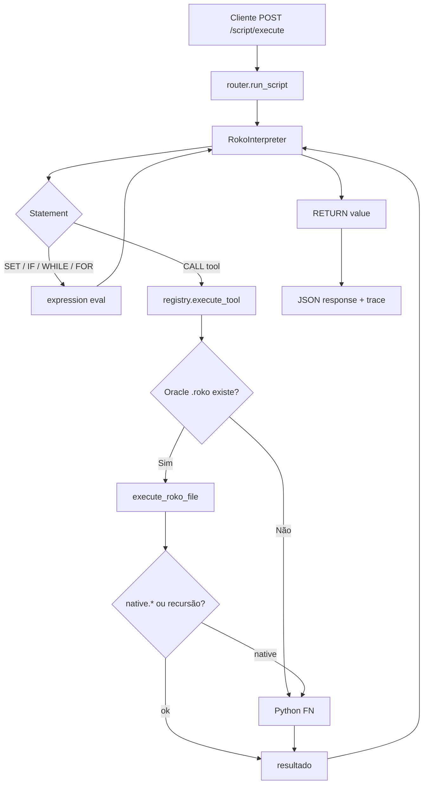
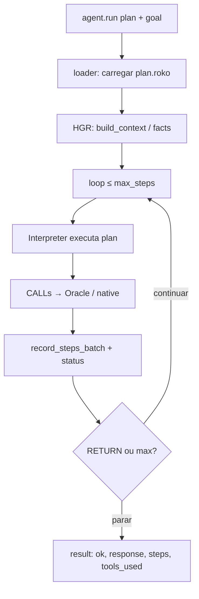

# Architecture — ROKO ENGINE LITE 2.3.1

## Visão geral

ROKO ENGINE LITE é um runtime de automação **simbólico** (sem LLM obrigatório): interpreta scripts na linguagem ROKO, resolve tools via registry (Oracle `.roko` prioritário + native Python), persiste contexto no HGR e expõe API HTTP (Quart).

## Camadas

```text
┌─────────────────────────────────────────────────────────────┐
│  Clientes / SSE / Quick Routes                               │
└──────────────────────────┬──────────────────────────────────┘
                           │
┌──────────────────────────▼──────────────────────────────────┐
│  APP (api.py + router.py) — Quart                            │
│  /  /health  /version  /tool/*  /script/*  /math/* …         │
└──────────────────────────┬──────────────────────────────────┘
                           │
          ┌────────────────┼────────────────┐
          ▼                ▼                ▼
   run_script()     execute_tool()     agent.run
          │                │                │
┌─────────▼────────────────▼────────────────▼─────────────────┐
│  engine/                                                     │
│  ├── interpreter + parser + expression                       │
│  ├── agent/ (loop, loader, context, result)                  │
│  ├── hgr/   (facts, steps, chat, cron, auth, facade)         │
│  ├── parallel/ (Motor Parallel)                              │
│  └── roko_tool.py (discover + execute .roko)                 │
└──────────────────────────┬──────────────────────────────────┘
                           │
┌──────────────────────────▼──────────────────────────────────┐
│  TOOLS.registry                                              │
│  CALL name  → Oracle/<cat>/<name>.roko  (prioridade)         │
│  CALL native.name → TOOLS/<cat>/<name>/tool.py               │
│  meta.* (info, tools, categories, help, search)              │
└─────────────────────────────────────────────────────────────┘
```

## Diagrama de fluxo — Script



## Diagrama de fluxo — Agent simbólico



## Oracle vs TOOLS

| Aspecto | Oracle (`*.roko`) | TOOLS (Python) |
|---------|-------------------|----------------|
| Prioridade CALL | Alta (nome público) | Via `native.*` |
| Edição | Texto ROKO | Código Python |
| Uso típico | Composição, lógica | I/O, crypto, HTTP, sistema |
| Anti-recursão | Stack; fallback native | — |

Wrappers Oracle típicos:

```roko
CALL native.http.get_json WITH url=${url}, headers=${headers} AS r
RETURN ${r}
```

## HGR (memória)

- SQLite WAL: chat, facts, context_steps (v5), cron
- Auth em DB separada
- v5: `status`, `parallel_group`, `record_steps_batch`, facade `MemoryEnhancedAgent`
- Tools: `memory.store_fact`, `get_fact`, `search_facts`, `build_context`, `record_step`, …

## Motor Parallel

- Filas nomeadas, workers, timeout, status, await/cancel
- Integrável em scripts e no agent (parallel_group nos steps)

## Limites de segurança (`engine/limits.py`)

- `MAX_EXEC_SECONDS = 60`
- `MAX_SCRIPT_LINES = 10000`
- `MAX_WHILE_ITERATIONS = 5000`
- `MAX_LOOP_TOTAL_STEPS = 50000`
- `MAX_BLOCK_DEPTH = 64`

## Contagem de tools (2.3.1)

- 121 tools Oracle (`.roko`)
- 5 meta (`meta.info`, `meta.tools`, `meta.categories`, `meta.help`, `meta.search`)
- Total público: **126**
- Natives Python registados como `native.*` (não contam no total público)

Categorias: agent, auth, cron, crypto, date, http, json, list, log, math, memory, meta, parallel, random, string, system.

## Ficheiros-chave

| Ficheiro | Papel |
|----------|--------|
| `main.py` | Entry point, sobe Quart |
| `APP/api.py` | Rotas HTTP |
| `APP/router.py` | run_script / validação |
| `TOOLS/registry.py` | Discovery + execute_tool |
| `engine/interpreter.py` | Execução ROKO |
| `engine/roko_tool.py` | Oracle discovery/execução |
| `engine/agent/loop.py` | Loop agent.run |
| `engine/hgr/*` | Persistência |
| `engine/parallel/motor.py` | Filas paralelas |

## Diagrama de pastas (resumo)

```text
ROKO_ENGINE_LITE/
├── APP/           # API
├── DOCS/          # Documentação + diagramas
├── Oracle/        # *.roko por categoria + demos/
├── TOOLS/         # Python + registry
├── engine/        # core runtime
├── plans/         # planos agent
├── tests/         # smoke + battery
├── examples/
└── main.py
```
